# Model

- If we have a table then each of these columns would be a feature of the data. Or if we wanted to train our model with, for example, images, then each pixel there could be considered a feature.

- From this training data we can then train a model.

- The model learns so-called parameters. These are the values that the model internally adjusts or learns in order to be able to fit or to describe the data. Fit would be the technical term. Training is the process during which the model learns how to deal with this data, so it tries to reduce the difference between its prediction and the actual result of our data. So this is the process of training in which the model learns its parameters.

- And then once everything is done, we can then use the model to make predictions. This process is called inference. And this just means that we want to then apply the model to new data. And then what we get out of the model would be a prediction which is the predicted result. And this is then the output of the model.

- So this is the whole structure of the machine learning training process here. Throughout this course we are going to focus on neurons and then also on neural networks, which are nowadays one of the most common structures to perform machine learning. But just be aware, there might also be or there are also other machine learning algorithms that we could plug in and use as a model. But I would say nowadays neural networks are the most common

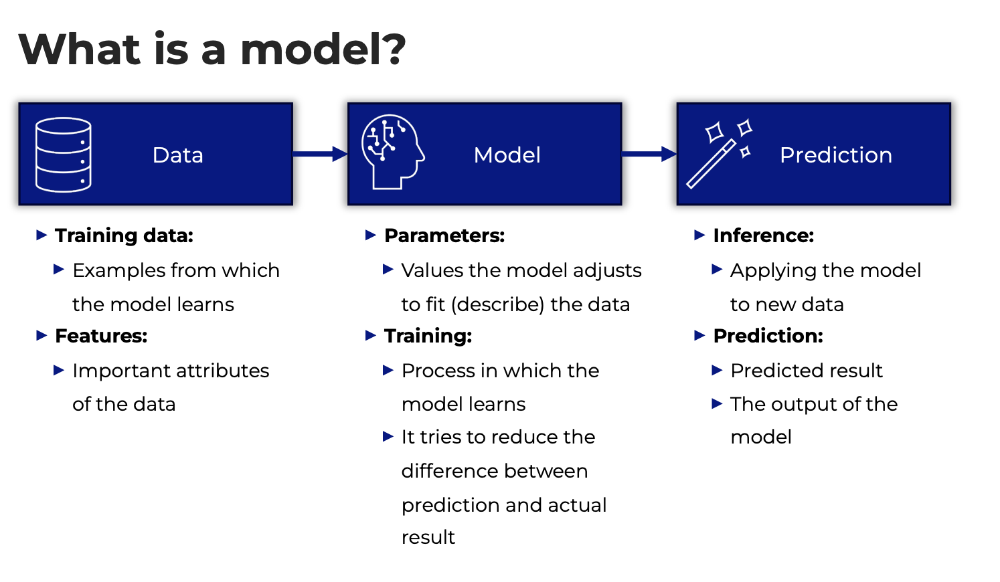

# A neuron

- Here we have Features. These are our data points. Then we have weights this is what model is going to learn or the parameters of the model. Then we have the neuron that combines all of these things together. And then at the end we have a prediction here.

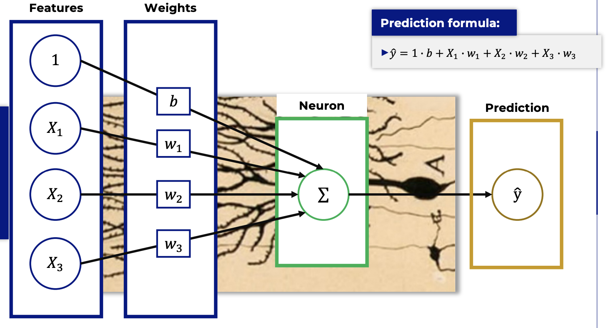

- So the input here consists out of a single feature, that is the temperature in degrees Celsius, and the output should be the temperature in degrees Fahrenheit.

- The temperature in degrees Celsius that you can see here it's x1.

- We can see here this weight the first weight here for the first feature. Here we only got one. But this would be need to be set to 1.8. This is a parameter that we would usually come up with during training. So all of these parameters here would be learned. But for now we are just going to set them to the correct values.

- Then here we got our bias term. The bias term pretty much just means that we always have a feature that is set to one or like a vertical virtual feature. So this one here is not actually part of our data, but it's always a one.

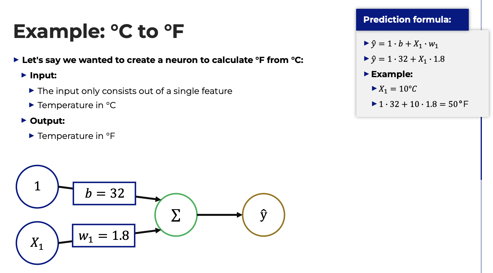

# Tensor

- Tensors are a core concept in PyTorch. But they are pretty much just a box in which values are being stored.

- This enables efficient data handling because this makes our calculations a bit more efficient because this box can be stored, for example, on optimized hardware such as GPUs, and calculations can then be performed there.

- And the big advantage is that us as programmers, we can just write normal Python code, and PyTorch just happens to store the actual data on the optimized hardware. But we don't, for example, need to write the code that actually runs on the GPU. And this makes it relatively easy to write GPU optimized code.

- because of this, uh, these tensors significantly speed up deep learning training, meaning that we want to extract meaning from data and inference, which means that we want to apply a model to new data. So both of these can be significantly sped up.

- There are different versions of a tensor. So for example, a tensor could just hold a single value. Or you can see here multiple values or even a matrix.

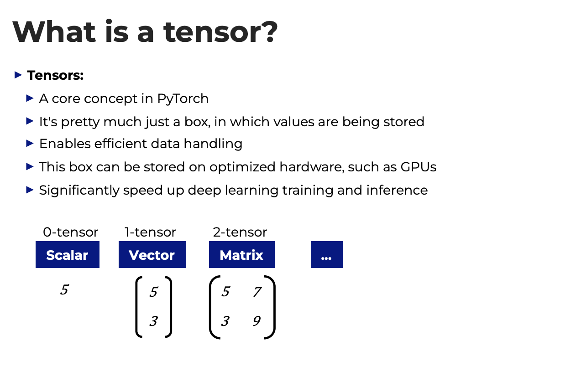

# How neuron learns

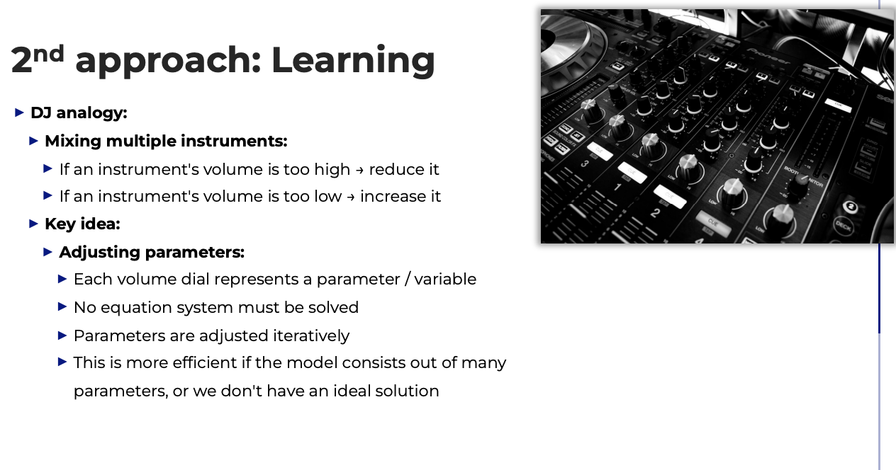

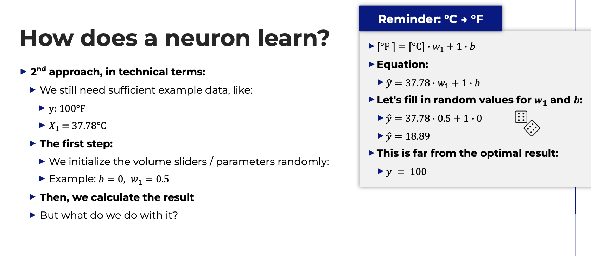

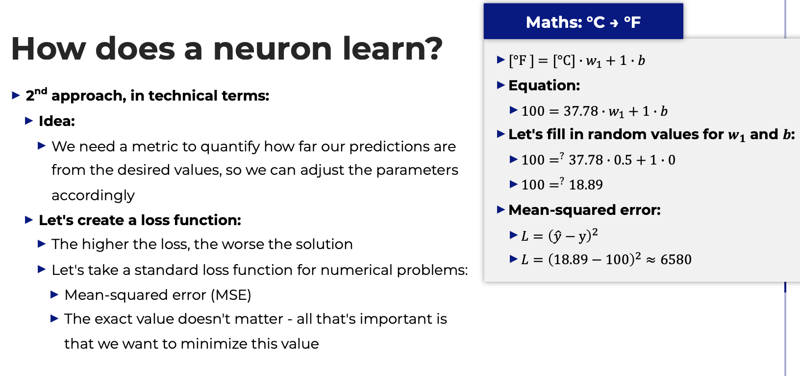

- So the idea with learning is that we want to now nudge the parameters here in our case w1 and B, and we want to nudge them into the right direction to minimize the loss function. We do this by checking in which direction and how far we would have to nudge these parameters. And then we are like, okay, this parameter, we would have to nudge quite much and this one a little bit less, but then we multiply it with a learning rate. This is usually referred to as eta. And this defines how much we want to nudge these parameters or these weights. And typically it's between 0.001 and 0.1.

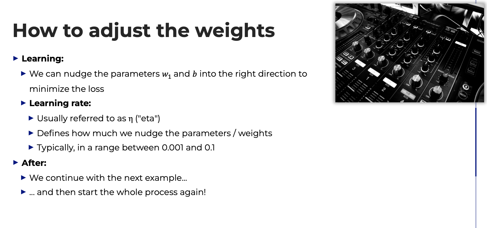

- So on the y axis is our loss function that we want to minimize. And on the x axis it would be our parameter w1. If we go to the right or um yeah here we would increase w1 and into this direction we would decrease w1.

- So what we are interested in is this slope.

- adjust parameters based on their influence. The greater the impact of a parameter, the greater we need to adjust it. If the impact of a parameter is minimal, then we also just need to adjust this parameter like significantly less.

- gradient tells us how much a parameter affects the error. It shows the direction and the rate of change of the error with respect to that parameter. We calculate the gradient for each parameter that we want to optimize, and then we know how this parameter influences the outcome of the loss function.

- our x axis, we have a plot of our parameter w1 vs loss function in y-axis

- `-6124.15` just means if we were to increase w1 then our for example by one, then probably our loss would go down by 6124.15.

- If we would increase b then our loss would also go down, but not as much as uh for W1.

- To calculate all of these derivatives. PyTorch is already doing that for us and we don't need to worry about it.

- We introduce a learning rate because we don't want to do the full adjustment. That would be too much. We risk overshooting things. We want to slowly approach the minimum. So we introduce a learning rate to slow everything down a little bit.

- Learning rate: This is kind of like the step size that controls how much each weight is updated.

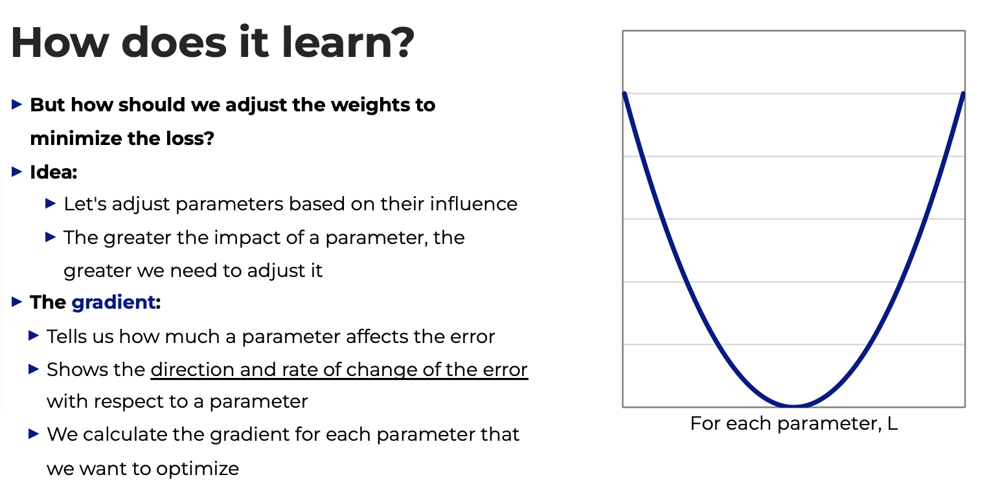

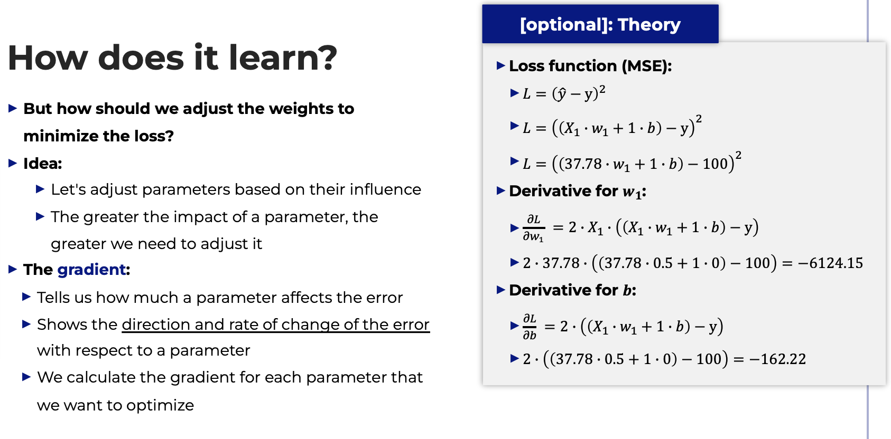

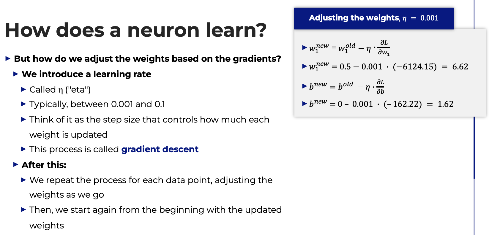

# Importance of MSE

- A, B, C, D these would be the points that I wanted to fit with my data.

- As long as the line is within our data points, nothing changes here and loss would exactly be 8. And only if we go outside of the range of our points Then you can see here how now here the loss is actually increasing.

- We might land up at the solution of line passing through A and D or line passing through B and C.

- But in the real world this is not the case. It's usually better to be always a little bit off than a few times. We are really far off.

- Now with MSE we have a line at the middle of these points. And this is usually a better solution.

- this is usually a way better solution because now we are always a bit off. But at least we are consistent about that. And overall we are matching the general trend of the data better.

- this is the big advantage of mean squared error that if for example we have multiple solutions it well they are no longer multiple solutions. But we now here actually try to match something in the middle. And we also say that we are rather a little bit off a bit more often than a lot of in a few cases. And this is exactly what the mean squared error achieves here.

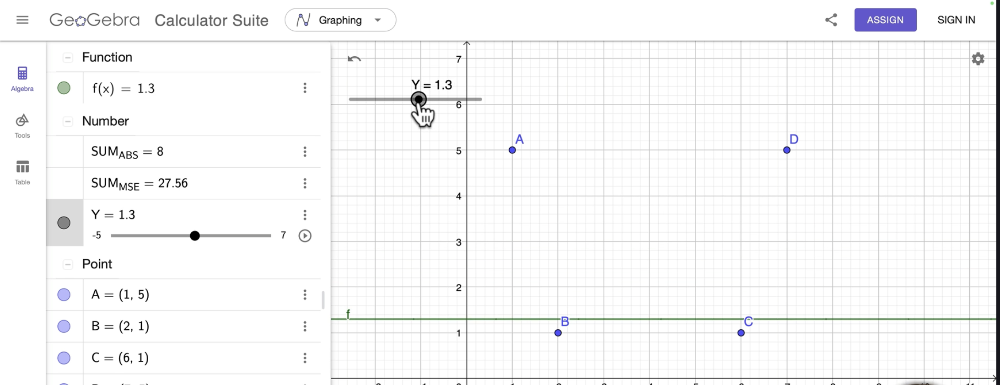

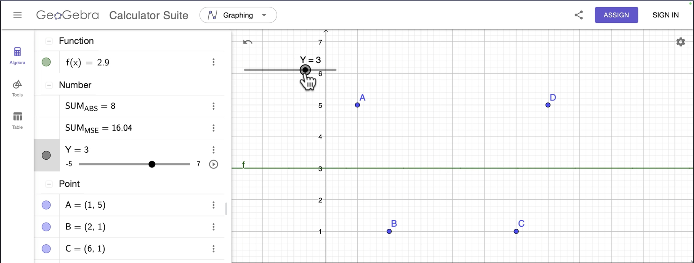

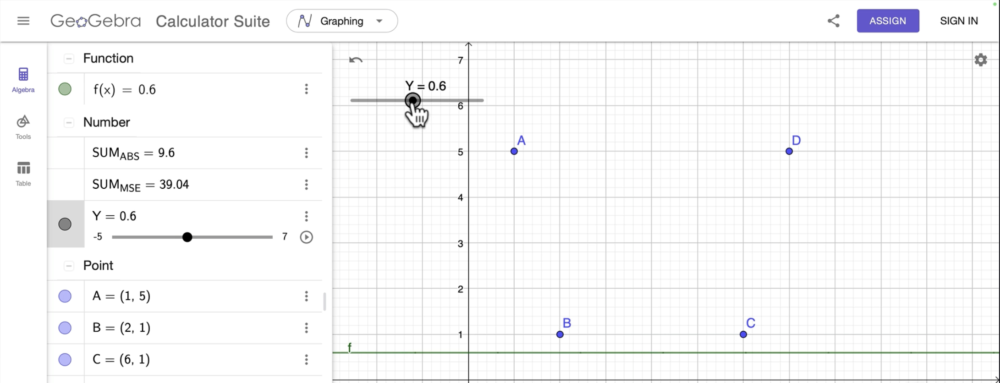

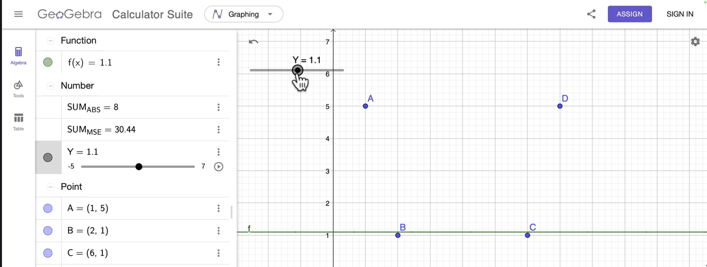

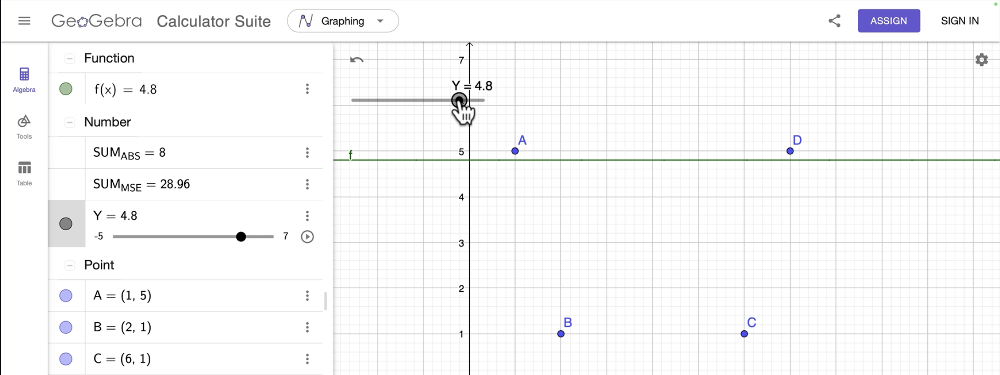

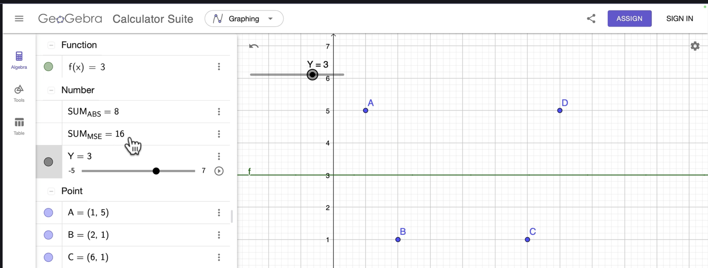

# Batch Leaning

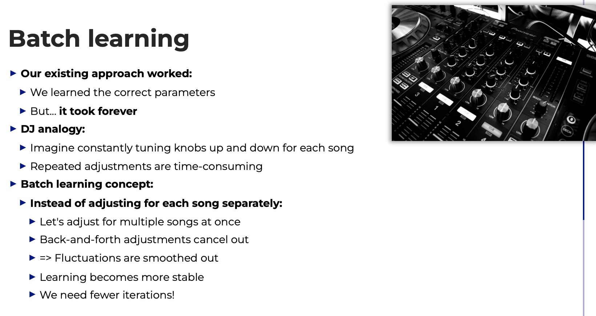

# Normalizing output

- let's say an old car would be worth $5,000, whereas a new car might be worth, let's say, $80,000. And this is a very, very large change. And of course, the model or the neuron needs to account for that by adjusting the weights appropriately. But if there are large changes that need to be made then the differences there are very big. And this made learning unstable. The result was that we experienced either when the learning rate was sufficiently small, almost no learning, or we experienced an explosion of the gradients.

- This means that we had a high difference between the predicted value and the actual value. So we had a large difference there. The loss function was mean squared error. So we would then calculate the difference between them and then square it. So this difference then got even larger.

- And these large gradients caused drastic weight updates that we could only account for by reducing the learning rate to almost nothing. Um, and only then we were able to at least come a little bit closer to, or at least be able to train it a little bit without it exploding.

- if we would normalize this data, this would help the neuron to better grasp the data, to better fit the data, because it would stabilize learning. It would put the predictions into a smaller range. Let's say, for example, pretty much the whole data was between the range minus two and plus two. And then the changes that would need to be done would be relatively small, or the predictions would fit into this smaller range, and this then results in smaller and more controlled gradients. Meaning we can work with a more appropriate learning rate and we can then actually make proper predictions. This overall would then lead to smoother weight updates and a more stable learning process.

- z score normalization: The first step is that we want to center the data around zero. Meaning mean of the data would be zero.

- And then the second step is that we just divide all the entries by the standard deviation. The standard deviation is a measurement on how far spread out the data is. The more spread out the data is, the higher the standard deviation. And then everything is back into a normal range. And then most of the data should usually be between -2 and 2. There might still be some outliers, but overall the data should then be in this form.

- And this will make it significantly easier for our neuron to learn everything.

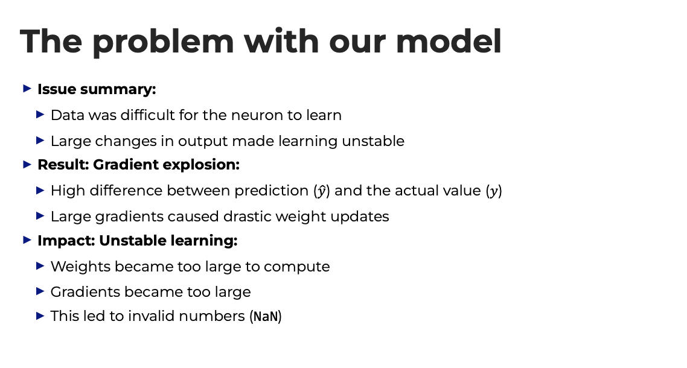

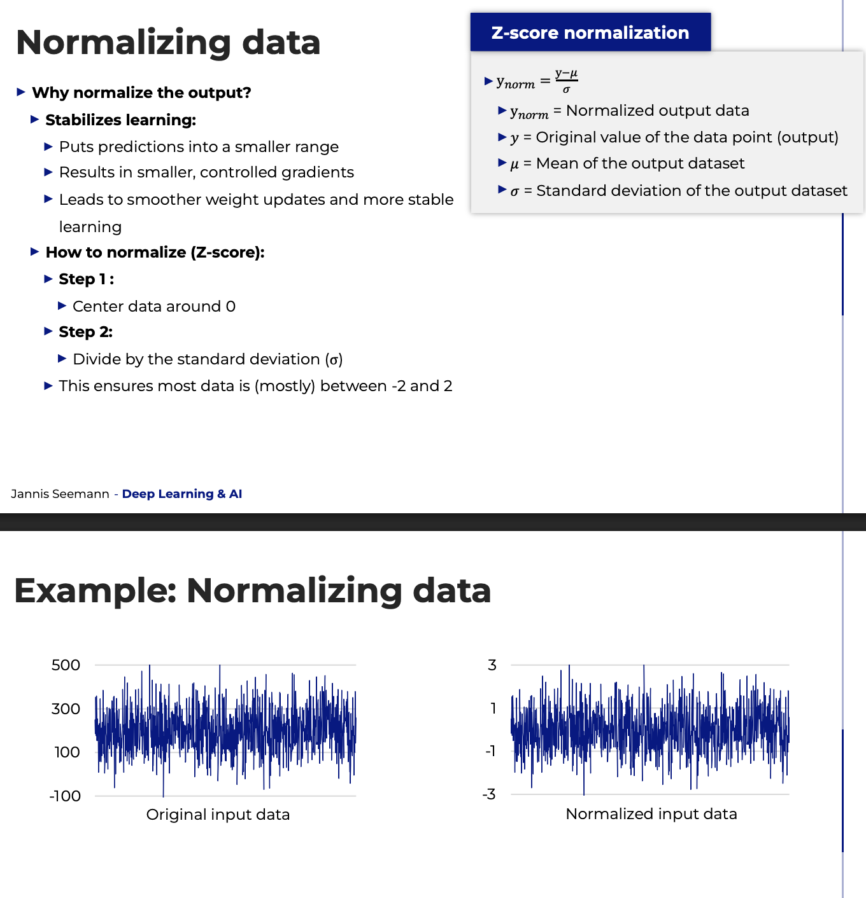

# Normalizing input

- the weights for parameter age have a more reduced effect on the output, because this parameter age is usually in the range between, let's say one year and 20 years. However, the weights for the parameter miles, they have an amplified effect because the number of miles driven varies between 1000 and 300,000. just a minor change to miles has a significant effect on the output. Just because on average the miles here are extremely high.

- we need to be extremely careful here when adjusting the miles, because small changes here have a major influence, but we need to be a little bit less careful when we are adjusting this weight for age, because a small change will also just have a relatively small change on the output.

- And this is a little bit difficult for the neuron, because we would then need different learning rates. For both of these parameters. And the best solution here is that we just normalize the input data and then we achieve that everything is on the same scale. And then we can just use a normal learning rate for both of these parameters.

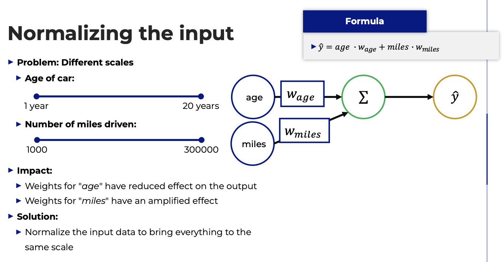

# Learning Rate

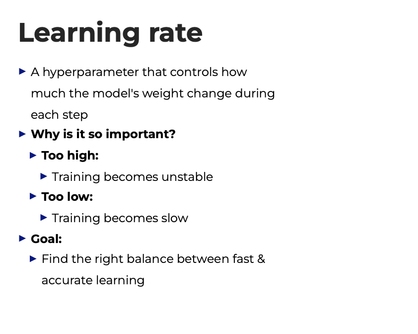

# TF IDF

- That usually leads to better results because it takes into account that if a word is just, let's say a filler word like "the", it has no meaning. And it also takes into account that if a text is longer, the words there also then have less meaning.

- Term frequency : This term frequency would look at a single message. And the more often a word occurs there, the higher this term frequency is. The more words we have in that document, the more we are dividing it by. So this term frequency is kind of like normalizing that so that if, for example, we have a short message, each of the words there have a higher weight, whereas if we, for example, have a longer message, then each of the terms has a lower weight, because then we have more terms in that document that we are dividing by. So this is the term frequency.

- Inverse document frequency : Then we also got the IDF, the inverse document frequency. And there the idea is that we want to reduce the weight of common terms. For example if "the" word the would be contained in all of our messages, then we would take the total number of documents. Let's say for example, we had 5000 documents and 5000 of these documents would contain the word "the". So the word the would be completely meaningless. In that case we would have 5000 divided by 5000. That would be one And then the logarithm of that would be zero.

- The result then is that TF-IDF prioritizes important rare words over frequently occurring, less meaningful words.

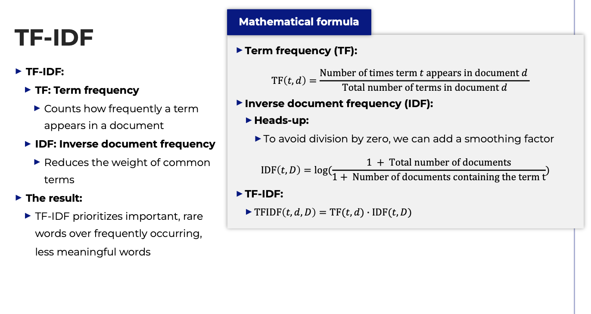

# Activation function: Sigmoid function

- function that can just map linear output to the range of 0 to 1.

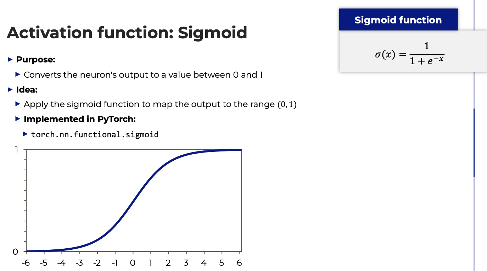

# Using sigmoid and BCEWithLogitsLoss

- we got a little bit of a challenge there when we are using the MSE loss with signmoid. The problem is that the error there is just too small. And then the gradients become small as well. And then the neuron struggles to learn efficiently.

- we need a different loss function, so that we can actually learn the output of a neuron with a sigmoid function applied to it.

- Using we got a little bit of a challenge there when we are using the MSE loss. The problem is that the error there is just too small. And then the gradients become small as well. And then the neuron struggles to learn efficiently.

- So yes, we apply the sigmoid function to the output of the neuron. But then when it comes to the loss, we use this BCE loss (binary cross entropy loss) to kind of like undo a little bit of the effects of the sigmoid function. And then we still have this pulling force when it comes to the loss function.

- So we are applying the sigmoid so that we get probabilities to the neuron. And then with the BCE loss function, we are then kind of like undoing a little bit there so that we can still train properly,

- Instead of first calculating the output and then throwing it into the sigmoid function and then applying the loss function on it, what we are going to do is that we are just going to change the loss function. And this will already apply sigmoid for us, because these mathematical calculations are going to cancel each other out and then everything is more easy or more stable to calculate. However, we need to be aware that once we are making a prediction, we need to apply sigmoid manually.

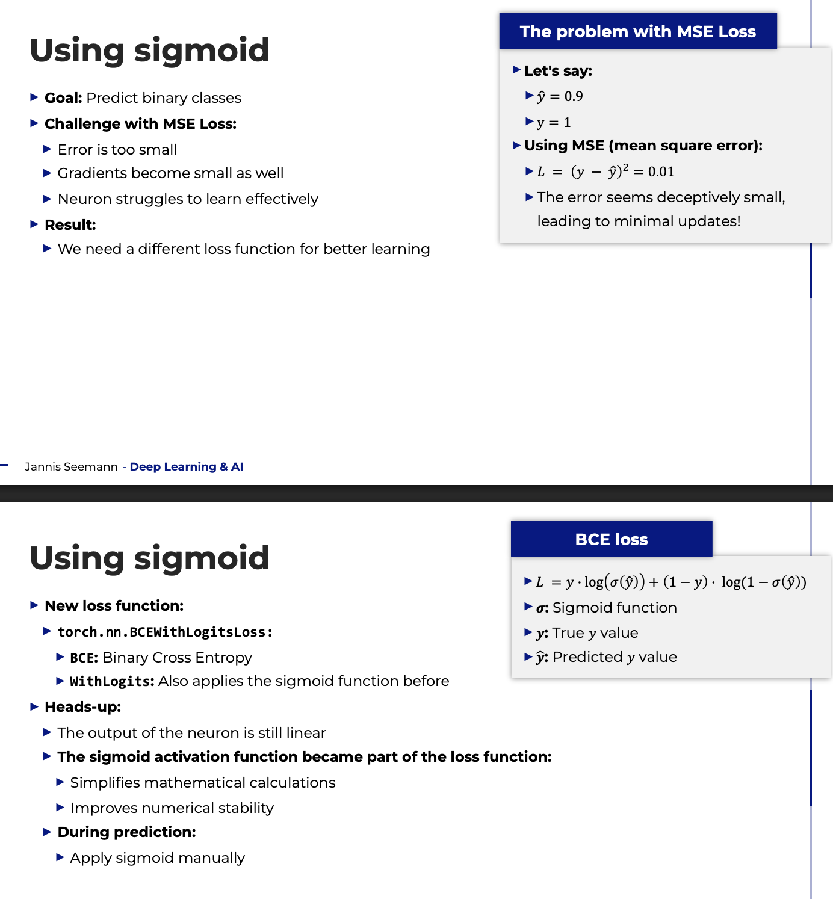

# Evaluating model

## Accuracy:

- This would just answer the question for what percentage is the true value of our messages, whether they are spam or not. Spam exactly identical to the prediction predicted value.

## sensitivity:

- sensitivity or true positive rate: This is the proportion of actual spam messages that got correctly identified. gGiven that we got a spam message, what percentage did the model predict correctly.

- It may be accurate in a sense that It detects a lot of things correctly, but for example, the sensitivity could be really low and in this case we would not actually filter many spam messages.

- For example, let's say you got you get 1000 normal emails and one spam email. If you had a model that would always accept all the emails and never reject any emails, then the accuracy would be really high because we have 1000 messages that got correctly accepted and one spam message that just got accepted as well However, the sensitivity here would be extremely low. It would be zero here, because the proportion of actual spam messages that got correctly identified

## specificity or the true negative rate:

- This is the proportion of actual non-spam messages that got correctly identified. So given that we are not having a spam message, what percentage did the model predict correctly.

- if you don't get an email from a potential customer and that would be a complaint, that could have serious consequences.

## Prediction:

- This stands for the proportion of predicted spam messages that are actually spam.

- given that the that the prediction is spam, what percentage had been spam originally.

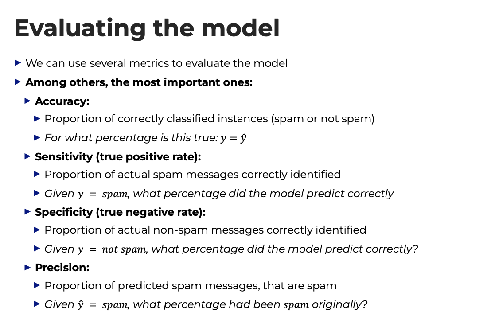

# Train / Validation / Test:

- we got normal parameters here(like bias, weights etc) that our model has. These are learned here during training.

- But there are hyper parameters that influence the structure of the model. For example for the countvectorizer how many features we got there, how many inputs we have here, what's the learning rate, how many training passes we got, where we do the cut off here when we consider something spam or not spam. So all of these things would be considered hyper parameters here.

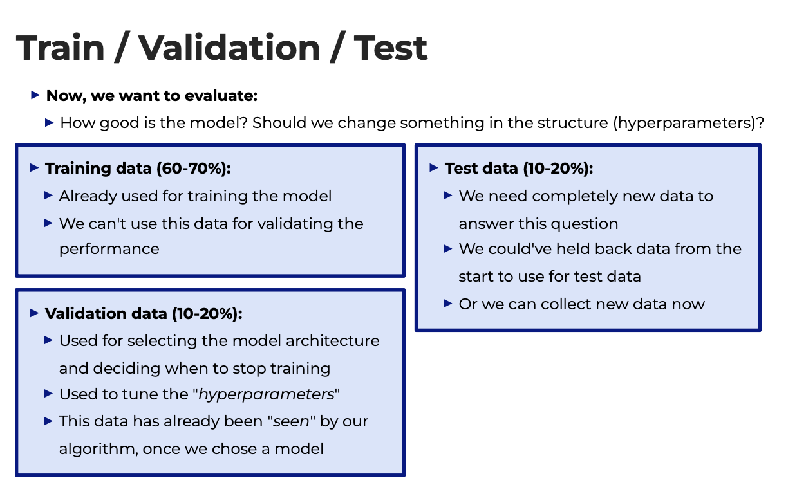

# LLM working

- the first step is that the text that we want to give to the LM is being tokenized. That means that it's not split into individual words, But each of the messages are being split into shorter tokens that are just a part of a word. This highly depends on the LLM that we want to use, but this is in general how it works.

- The next step is that the LLM is being trained. The LLM tries to predict the next token, and for this it must develop an internal representation of the input text, because otherwise it could not predict the next token.

- And based on the internal representation, it turns out that the LLM is then quite good at predicting the next token.

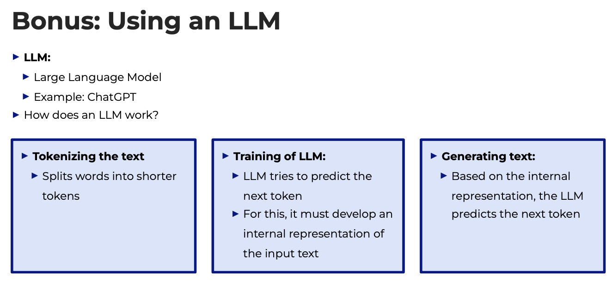

- an LLM consists out of many layers and they are attached to each other. So we got input. And then this input goes through many layers. And then eventually we come or we end up at the end where we then get the representation of the next token that is being predicted.

- one layer here would consist out of many neurons. They are all doing a similar thing but calculating different um, or they all have different weights. But aside from that they are usually the same. And then we would have many of these stacks one after another.

# idea Embeddings

- The idea is that we just take an existing pre-trained LM, and then we take the internal representation of the input inside the LM.

- And then the question would be, can't we just use this then to enhance or to run our spam filter. And it turns out that if we do so, then our spam filter will suddenly work extremely well because we are then no longer training it on individual words, but on the meaning of the text.

- And then suddenly also completely unknown things that, for example, just nowadays would be used inside emails could be captured as spam.

- This internal representation must have captured the meaning of the text in a numerical way.

- We can use this then to enhance or to run our spam filter on that. And it turns out that if we do so, then our spam filter will suddenly work extremely well because we are then no longer training it on individual words, but on the meaning of the text. And then suddenly also completely unknown things that, for example, just nowadays would be used inside emails could be captured as spam.

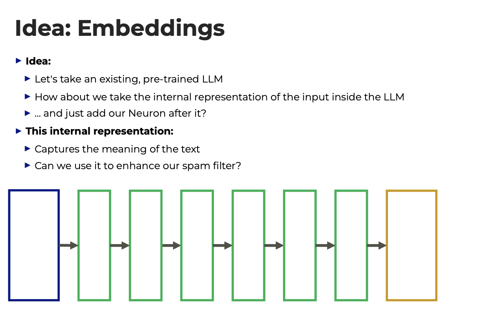

# Neuron to Neural network

- So, far we have learned how we can train a single neuron and how that one can learn. The next step is that we want to stack multiple neurons together to create a neural network.

- We had a single neuron that made a prediction here based on some inputs. And what we are going to explore throughout this chapter is what if we, for example, just put a few neurons before they can do some processing here. And then the output here then gets used as an input for this neuron. And then we use this to make the prediction.

- So you can see here how now we just have a stack of neurons here. They all have access to all the inputs here in this case. So all the inputs are connected to all the neurons here. They all have individual weights and also biases. They make here an intermediate prediction. And then this is being used for this neuron to then make the final prediction here.

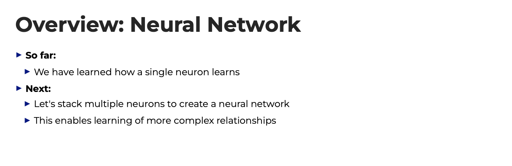

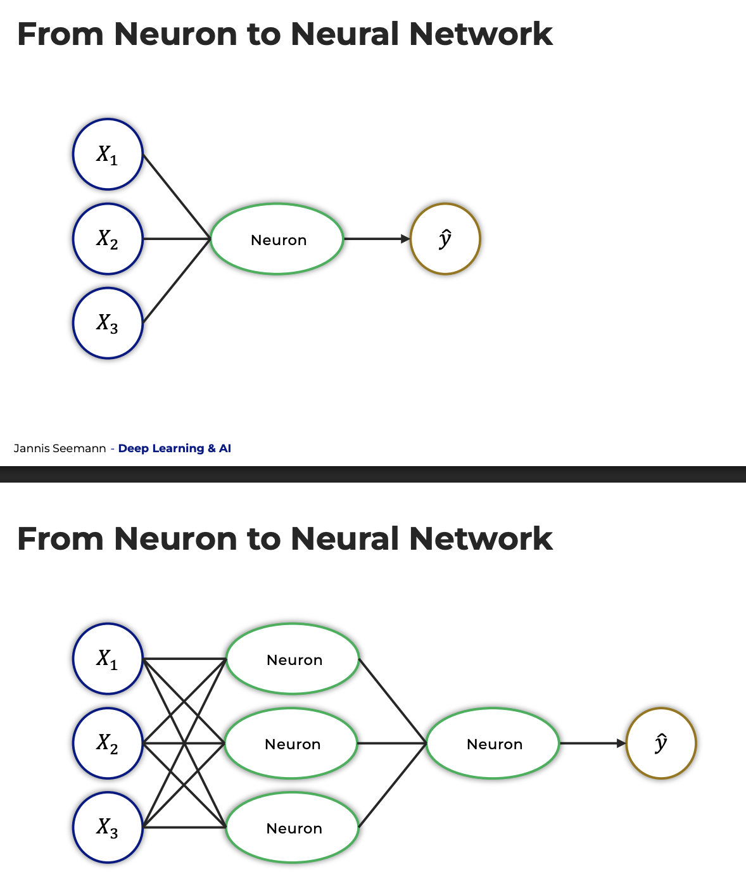

# Linearity problem and non-linear activation functions

- We want to explore in a visual way why we actually need a neural network, why a single neuron can't be able to grab all the problems, or why we can't use it to solve all the problems.

- So linearity means that we have limited learning capabilities. We are not going to be able to capture complex non-linear patterns in our data.

- A single linear neuron, even with a sigmoid function, won't be able to capture these non-linear relationships.

- For example, let's say we just had two variables, and based on that, we needed to make a prediction. Blue or orange. And in that case here in this case this would be a simple relationship that could be learned.

- Because what we could do is that we could just kind of like draw the line like this and then we would be able to capture this here.

- Um, so this would be a relationship that we would be able to capture with our linear neuron, and then we would put the sigmoid activation function on it, uh, to then we would have something like this here. Um, for example, orange could then be negative values. Blue could then be positive values. And then they get turned through the sigmoid function into probabilities.

- Well we could try we could try something like this. Well it's not going to be able to describe the data.

- What we would need now would be something like this that we would be like, okay, all the blue entries are inside this area here, and this now would just be a relationship that we would not be able to capture with a linear neuron.

- So linearity means that we got limited learning power. And this also means if we would now just have a network here that if the hidden layers are linear, the final output layer would also be just linear.

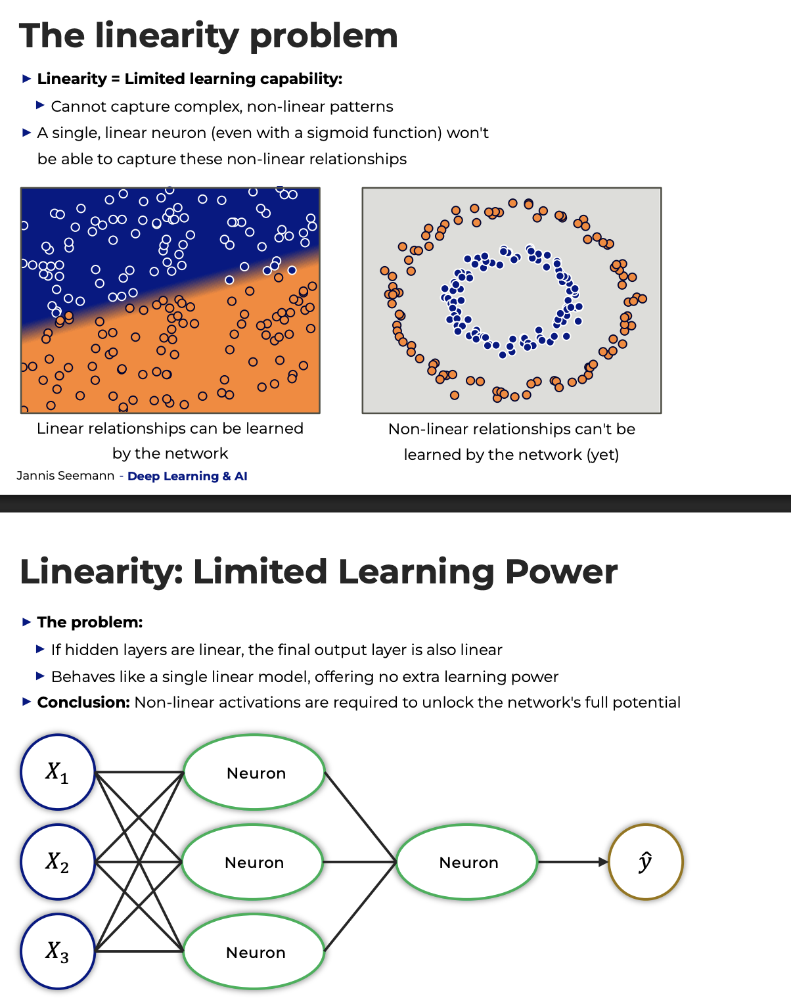

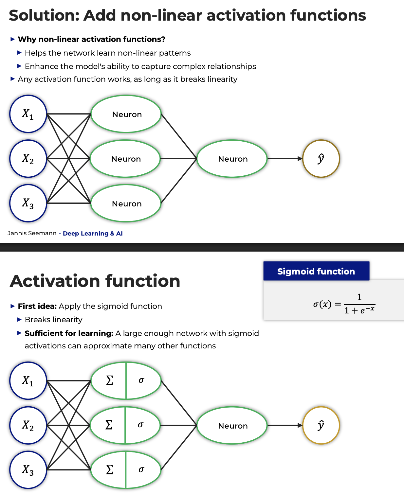

# BackPropagation

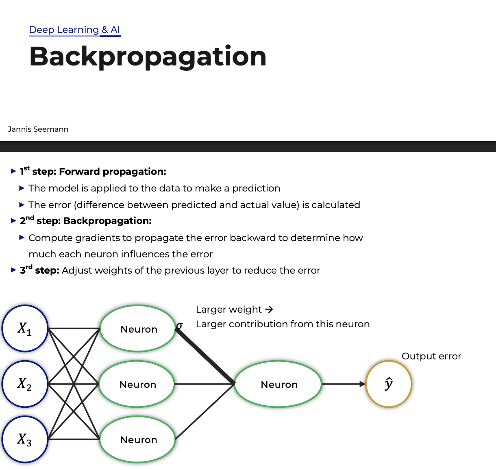

- Math behind BackPropagation

- The error is kind of like just the meaning of how would we need to have changed this output here with respect to our loss function

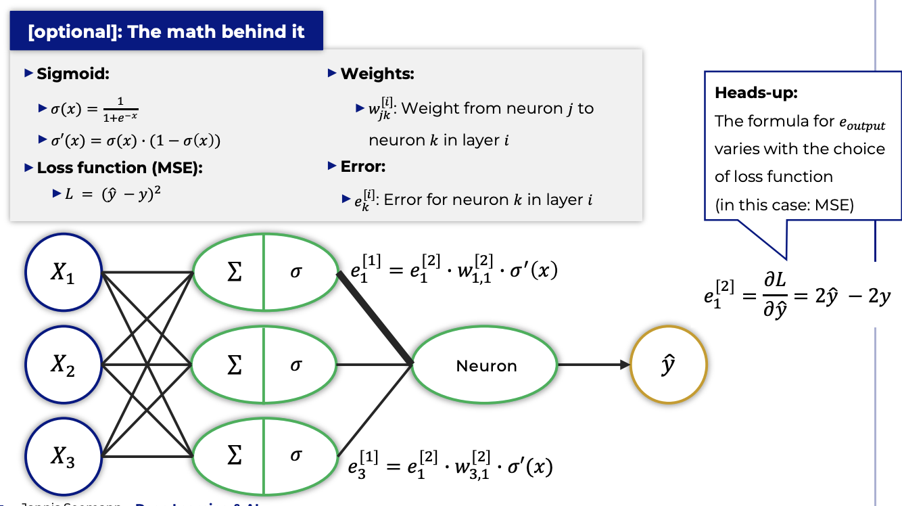

# Structure of the network

- We've chosen a hidden layer size of ten neurons. Well I had to choose something. So this felt like could be something that could work, but this would be something that we would need to tune with by withholding validation data. And this is something that we would need to tune just as all the other hyperparameters in our network. But I would say ten neurons in the hidden layer could be a good starting point.

- We we got ten hidden outputs here. They are all then connected to the last neuron which is then going to make a make a prediction. And of course there the sigmoid is applied. The sigmoid function is being applied to that because we are using the BCEWithLogitsLoss Loss function that includes the sigmoid function there.

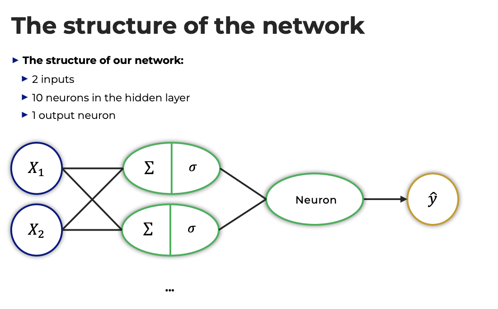

# ReLU

- So far here we had our inputs and then we had ten neurons here in this layer. It's abbreviated here again. But we calculated the sum and then applied the sigmoid function to it. And then fed this output into one last neuron to then actually make the prediction. So we used the sigmoid function as an activation function in between just because it breaks linearity.

- So once this linearity has had been broken, the weights of the network could then adjust to the rest

- in ReLU all the values below zero turn into just zero, and then all the values above zero. They are just being taken as they are.

- the sigmoid function outputted values between 0 and 1. And they can result into very very small gradients during back propagation. So if we had multiple layers there The gradients could become small, and then it's more difficult for the network to adjust the weights. However, for us here so far our network was relatively small, so this was not a major issue.

- Um, the the advantage here of the ReLU function is that it outputs either zero or the input itself if positive. And this is extremely easy, then to take the gradient. Fr example here, if it would be one, then we would just need to divide it by one, which we don't even need to do. We can just backpropagate it directly. And if we are at less than 0, then the activation there with respect to this neuron would be zero. And in that case we can just ignore it. So this makes backpropagation extremely simple because either the gradient here is exactly one or it is zero.

- Also we don't have, gradients that become smaller and smaller. Here the gradient would be one or zero. This property would be the so-called sparse activation.

- And just imagine we would be using this on the output of ten neurons. Then probably by chance, about five of these neurons would output a value below zero, which would then be just after applying ReLU. It would just be a zero then. And five of the neurons would predict a value above zero. And then we would just take the value here. So when we are using this activation function, only about 50% of neurons are activated. And this reduced or reduces the computational complexity and improves the generalization of the network, meaning that if it can't rely on some neurons or they suddenly are just zero, then the network is forced to look at the big picture instead of getting lost in the details.

- The next thing is that, of course, everything here is quite efficient to compute because it only involves a max operation which is extremely efficient or easy to calculate. And this is significantly easier to compute compared to the exponentials that we had when we utilized the sigmoid functions.

- Last but not least, this function of course, also breaks linearity because this is no longer a linear equation here if we have a look at this. So linearity has also been broken here.

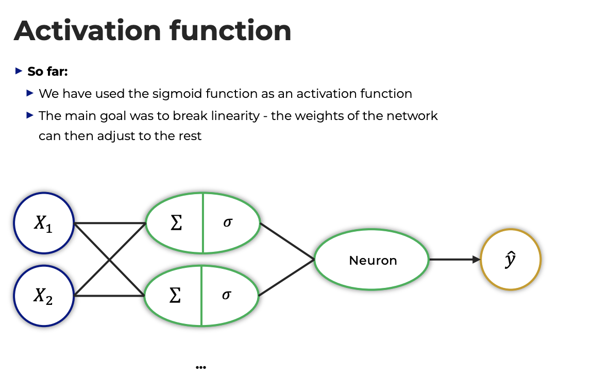

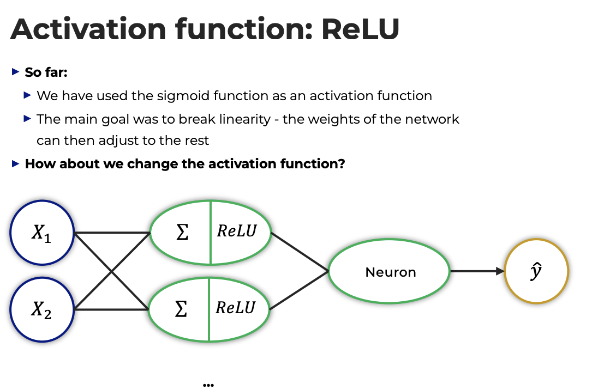

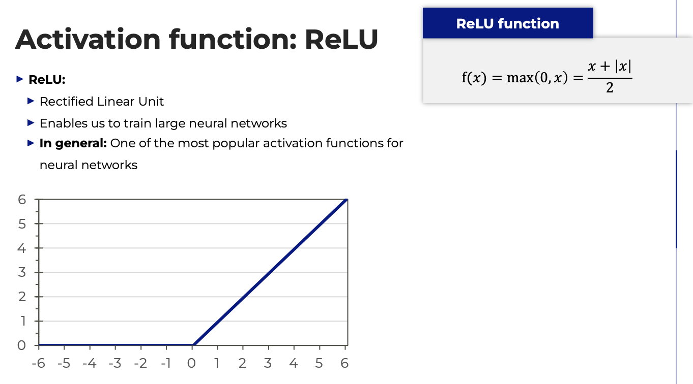

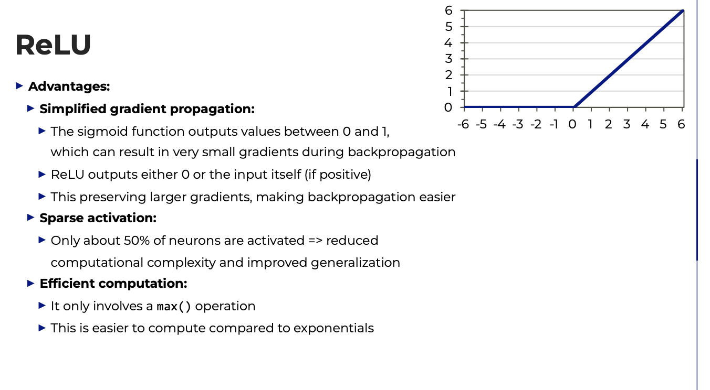

# Adam Optimizer

- The optimizer is responsible for optimizing the parameters meaning for example the weights here of this layer, the weights of this layer, the biases of these layers and so on. So all the parameters parameters here of our model are being optimized. And here in this case by stochastic gradient descent

- Previously to train the network we had to minimize the loss function. And our goal was to find the best parameters for example w1, w2 and b to minimize this loss function to end up here at the minimum.

- you can see here the slope is relatively fast, so our steps are very big. And then at some point here the slope is no longer that steep. And then we need to do a lot of steps. So here we would then do a lot of steps. Uh, and then at some point we would end up here at the minimum.

- But there's another approach that's called Adam or adaptive moment estimation.

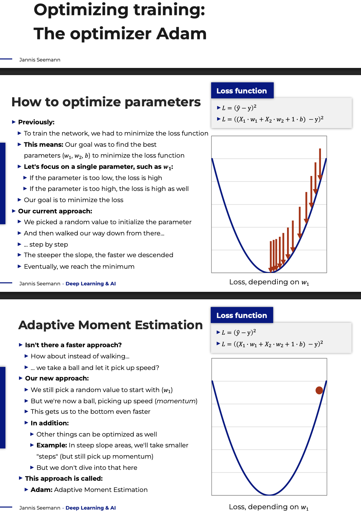

# Mini Batch Learning

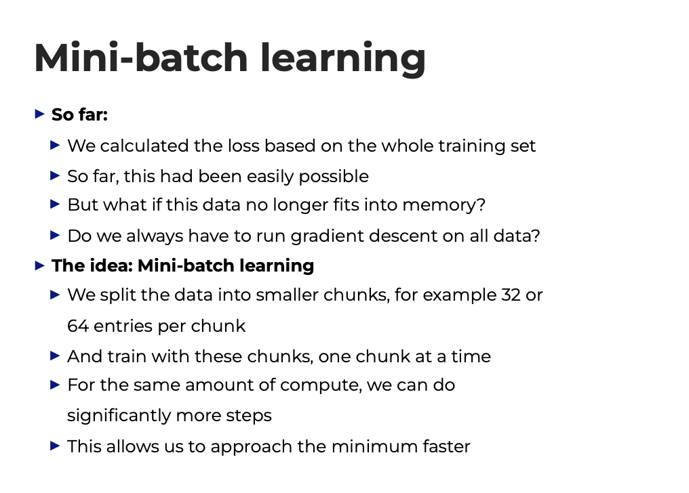
